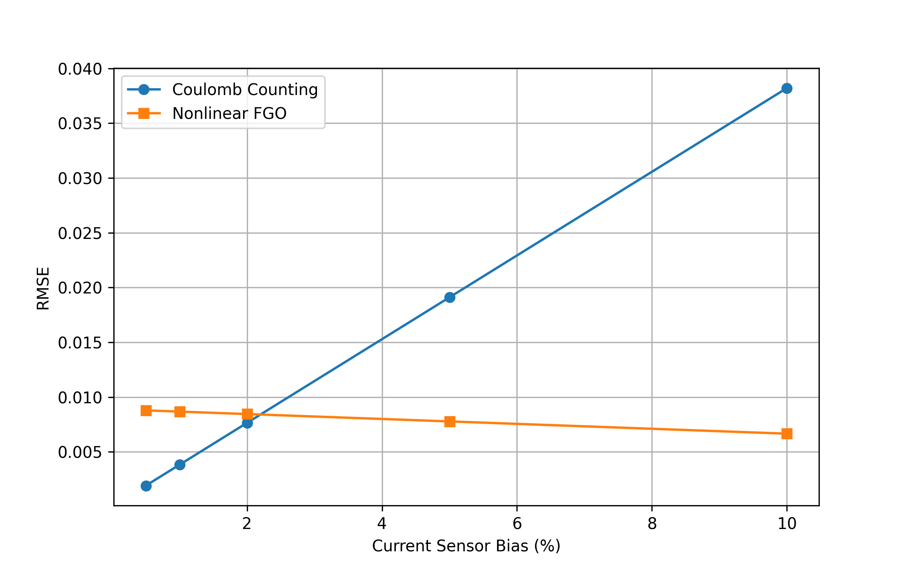
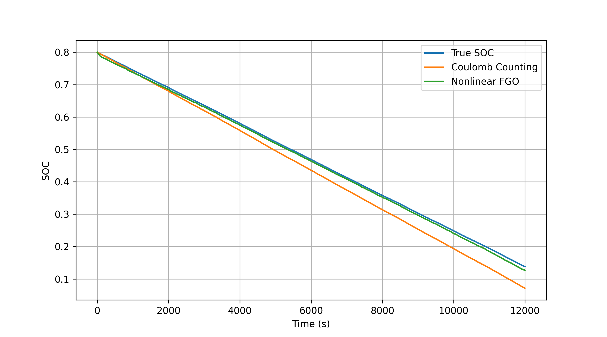
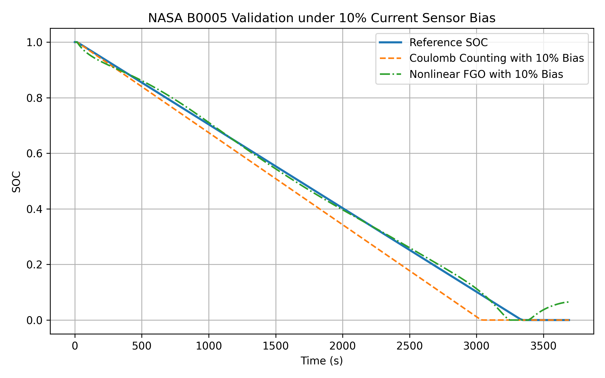
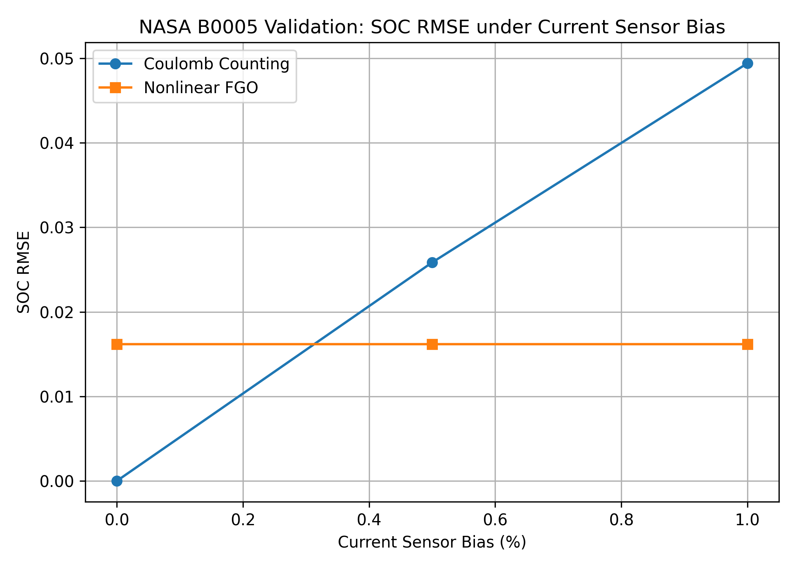

# Robust Battery State-of-Charge Estimation under Current Sensor Bias Using Nonlinear Factor Graph Optimization

## Abstract

Current sensor bias is a critical source of accumulated error in battery State-of-Charge (SOC) estimation. Although Coulomb Counting (CC) is widely used in Battery Management Systems due to its simplicity, even a small bias in current measurement can accumulate over time and cause significant SOC drift. This study focuses specifically on the robustness of SOC estimation under current sensor bias and proposes a nonlinear Factor Graph Optimization (FGO) framework that jointly incorporates current-based SOC transition constraints and voltage-based measurement constraints.

A first-order RC battery model was used to generate a 12,001-sample simulation dataset under random current profiles. Artificial current sensor biases of 0.5%, 1%, 2%, 5%, and 10% were introduced to evaluate the sensitivity of Coulomb Counting and nonlinear FGO. In addition, a preliminary real-data validation was conducted using the first discharge cycle of the NASA B0005 lithium-ion battery aging dataset, where 5% and 10% artificial current biases were applied to the measured current signal.

The simulation results show that the SOC error of Coulomb Counting increases rapidly as current bias grows, whereas nonlinear FGO maintains stable estimation accuracy by using voltage information to constrain the SOC trajectory. Under a 10% current sensor bias in the simulation dataset, the RMSE of Coulomb Counting increased to 0.0382, while nonlinear FGO achieved an RMSE of 0.0067. The NASA B0005 validation further supports this trend. Under 5% and 10% current bias, Coulomb Counting produced RMSE values of 0.02585 and 0.04941, respectively, whereas nonlinear FGO maintained a nearly stable RMSE of approximately 0.01618. These results indicate that nonlinear FGO can effectively reduce SOC drift caused by biased current measurements and improve the robustness of battery state estimation under sensor uncertainty.

**Keywords:** Battery Management System, State of Charge, Factor Graph Optimization, Current Sensor Bias, Sensor Uncertainty, Electric Vehicle

## 1 Introduction

Accurate State-of-Charge (SOC) estimation is essential for the safe and reliable operation of electric vehicles and battery energy storage systems. In practical Battery Management Systems (BMSs), SOC cannot be measured directly and is usually estimated from measurable signals such as current, voltage, and temperature. Among these signals, current measurement plays a central role because many SOC estimation methods rely on current integration or current-based state transition models. Therefore, even a small current sensor bias can accumulate over time and cause significant SOC estimation drift.

Coulomb Counting (CC) is one of the most widely used SOC estimation methods due to its simplicity and low computational cost. However, CC directly integrates the measured current, which makes it highly sensitive to current measurement errors. When a constant or slowly varying current sensor bias exists, the resulting SOC error accumulates monotonically during battery operation. This drift problem becomes especially serious during long-term operation and can reduce the reliability of energy management, driving range prediction, and battery protection functions.

To reduce accumulated estimation errors, model-based and optimization-based methods have been investigated for battery state estimation. Factor Graph Optimization (FGO) provides a flexible framework for combining multiple sources of information, such as current-based process constraints and voltage-based measurement constraints, into a unified optimization problem. Compared with simple current integration, FGO can use voltage measurements to correct the SOC trajectory and suppress drift caused by biased current measurements.

This study investigates the robustness of nonlinear FGO for battery SOC estimation under current sensor bias conditions. A first-order RC battery model is employed to generate battery operation data under random current profiles. Several levels of artificial current sensor bias are introduced into the measurements. The performance of conventional Coulomb Counting and nonlinear FGO is then compared using Root Mean Square Error (RMSE) and Mean Absolute Error (MAE). In addition, a preliminary real-data validation is conducted using the NASA B0005 lithium-ion battery aging dataset to further evaluate the proposed method under realistic voltage and current measurement conditions.

Unlike general SOC estimation studies that mainly compare estimation accuracy under nominal measurement conditions, this work focuses specifically on the robustness of SOC estimation under current sensor bias. The main objective is not only to evaluate whether nonlinear FGO can estimate SOC accurately, but also to investigate whether it can suppress the cumulative drift caused by biased current measurements.

The main contributions of this study are summarized as follows:

1. A current-sensor-bias-oriented SOC estimation problem is formulated to analyze the cumulative drift of Coulomb Counting under biased current measurements.

2. A nonlinear FGO-based SOC estimation framework is developed by combining current-based process constraints and voltage-based measurement constraints to improve robustness against current sensor bias.

3. The proposed method is evaluated using both controlled simulation data with multiple current bias levels and preliminary real battery validation based on the NASA B0005 dataset.

## 2 Battery Model
A first-order RC equivalent circuit model was employed in this study to simulate the dynamic behavior of a lithium-ion battery. Due to its balance between computational efficiency and modeling accuracy, the first-order RC model is widely used in battery state estimation research.

The model consists of an open-circuit voltage (OCV) source, an ohmic resistance (R_0), and a parallel RC network composed of resistance (R_1) and capacitance (C_1). The RC network is used to represent battery polarization effects and transient voltage dynamics during charging and discharging processes.

The battery State-of-Charge (SOC) is updated using the Coulomb Counting principle:

SOC(k+1) = SOC(k) - \frac{I(k)\Delta t}{Q}

where (I(k)) is the battery current, (\Delta t) is the sampling interval, and (Q) is the battery capacity in Coulombs.

The polarization voltage of the RC branch is modeled as:

V_{RC}(k+1) = \alpha V_{RC}(k) + (1-\alpha)R_1I(k)

where

\alpha = e^{-\frac{\Delta t}{R_1C_1}}

The terminal voltage is calculated as:

V(k) = OCV(SOC(k)) - I(k)R_0 - V_{RC}(k)

In this work, the battery model parameters were selected as:

* (R_0 = 0.01\ \Omega)
* (R_1 = 0.02\ \Omega)
* (C_1 = 2000\ F)

The initial SOC was set to 0.8. Random current profiles ranging from 0.2 A to 1.0 A were generated to emulate varying battery operating conditions. Current sensor bias was then introduced into the measurements to evaluate the robustness of different SOC estimation approaches.

## 3 Nonlinear Factor Graph Optimization
The battery SOC estimation problem was formulated as a nonlinear Factor Graph Optimization (FGO) problem. In a factor graph, unknown state variables are represented as nodes, while measurement constraints are represented as factors connecting these nodes.

In this study, the SOC value at each time step was defined as a state variable:

x_k = SOC(k)

The objective of FGO is to estimate the optimal sequence of SOC states by minimizing the overall error generated by all constraints in the graph.

### 3.1 Process Factor

The process factor describes the battery SOC evolution according to the Coulomb Counting principle. For two consecutive states, the process model is given by:

SOC(k+1) = SOC(k) - \frac{I(k)\Delta t}{Q}

where (I(k)) denotes the measured current, (\Delta t) is the sampling interval, and (Q) is the battery capacity.

This relationship is implemented as a process factor connecting adjacent SOC nodes in the graph. The process factor provides the primary state transition information but may accumulate errors when current sensor bias exists.

### 3.2 Voltage Factor

To compensate for accumulated drift, battery terminal voltage measurements are incorporated as additional constraints.

The predicted terminal voltage is computed using the battery model:

V_{pred}(k) = OCV(SOC(k)) - I(k)R_0 - V_{RC}(k)

The voltage factor is defined as the difference between measured voltage and predicted voltage:

e_v(k) = V_{meas}(k) - V_{pred}(k)

Unlike Coulomb Counting, which relies solely on current integration, the voltage factor continuously constrains the SOC estimate using voltage observations. This mechanism allows the optimization process to correct accumulated SOC drift caused by biased current measurements.

### 3.3 Nonlinear Optimization

The complete factor graph consists of process factors and voltage factors over the entire estimation horizon.

The optimal SOC trajectory is obtained by minimizing the total nonlinear least-squares cost function:

J = \sum e_p^2 + \sum e_v^2

where (e_p) represents process-factor residuals and (e_v) represents voltage-factor residuals.

The optimization was implemented using the Georgia Tech Smoothing and Mapping (GTSAM) library. Initial SOC estimates were generated using Coulomb Counting and subsequently refined through nonlinear optimization.

By jointly utilizing historical information and voltage constraints, nonlinear FGO can reduce estimation drift and improve robustness against sensor uncertainties.

## 4 Experimental Design

To evaluate the robustness of nonlinear Factor Graph Optimization under current sensor bias conditions, a simulation-based experimental framework was developed.

A first-order RC battery model was used to generate battery operation data. The simulation duration was set to 12,000 seconds with a sampling interval of 1 second, resulting in a dataset containing 12,001 samples. The battery current was randomly generated within the range of 0.2 A to 1.0 A to emulate varying operating conditions. The initial SOC was set to 0.8.

The generated dataset contained the following variables:

* Time
* Battery current
* Terminal voltage
* Ground-truth SOC

To investigate the influence of current sensor bias, five biased datasets were created from the baseline dataset. The current measurements were multiplied by a constant bias factor while keeping the true battery dynamics unchanged.

The evaluated bias levels were:

* 0.5%
* 1.0%
* 2.0%
* 5.0%
* 10.0%

For each bias level, the main comparison was conducted between Coulomb Counting (CC) and Nonlinear Factor Graph Optimization (Nonlinear FGO). Linear FGO results were also recorded as an auxiliary reference, but the primary focus of this study is the robustness of nonlinear voltage-constrained FGO under current sensor bias.

The estimated SOC values were compared against the ground-truth SOC generated by the battery simulator.

Two commonly used evaluation metrics were adopted:

Root Mean Square Error (RMSE)

RMSE = \sqrt{\frac{1}{N}\sum_{i=1}^{N}(SOC_{est,i}-SOC_{true,i})^2}

Mean Absolute Error (MAE)

MAE = \frac{1}{N}\sum_{i=1}^{N}|SOC_{est,i}-SOC_{true,i}|

All optimization procedures were implemented using the GTSAM library in C++. The experiments were conducted on Linux using the same battery model and estimation framework for all tested bias levels to ensure a fair comparison.

## 5 Results and Discussion

The estimation performance of Coulomb Counting (CC), Linear FGO, and Nonlinear FGO was evaluated under different levels of current sensor bias. The RMSE and MAE values were calculated using the ground-truth SOC generated by the battery model.

Table 1 summarizes the RMSE results obtained from the experiments.

| Current Sensor Bias | CC RMSE | Nonlinear FGO RMSE |
| ------------------- | ------- | ------------------ |
| 0.5%                | 0.00191 | 0.00878            |
| 1.0%                | 0.00382 | 0.00867            |
| 2.0%                | 0.00764 | 0.00845            |
| 5.0%                | 0.01911 | 0.00778            |
| 10.0%               | 0.03821 | 0.00666            |

Figure 1 illustrates the relationship between current sensor bias and estimation RMSE.

**Figure 1. RMSE comparison under different current sensor bias levels.**

The results reveal two distinct trends. First, the estimation error of Coulomb Counting increases rapidly as current sensor bias grows. Since Coulomb Counting relies exclusively on current integration, any systematic measurement bias accumulates over time and leads to increasing SOC drift.

Second, the estimation error of Nonlinear FGO remains relatively stable across all tested bias levels. Unlike Coulomb Counting, Nonlinear FGO incorporates terminal voltage measurements as additional constraints. These voltage constraints continuously correct accumulated SOC errors during optimization, preventing long-term drift.

Interestingly, the robustness advantage of Nonlinear FGO becomes increasingly apparent at higher bias levels. At a bias of 10%, the RMSE of Coulomb Counting reached 0.03821, while the RMSE of Nonlinear FGO remained at only 0.00666. This corresponds to an error reduction of approximately 82.6%.

To further visualize the estimation behavior, Figure 2 compares the SOC trajectories under the 10% bias condition.

**Figure 2. SOC estimation trajectories under 10% current sensor bias.**

As shown in Figure 2, the Coulomb Counting estimate gradually deviates from the true SOC trajectory due to cumulative integration errors. In contrast, the Nonlinear FGO estimate closely follows the ground-truth SOC throughout the entire experiment. The voltage-constrained optimization effectively suppresses the drift caused by biased current measurements.

These results demonstrate that Nonlinear FGO provides significantly improved robustness against current sensor bias compared with conventional Coulomb Counting. The ability to integrate both process information and voltage measurements enables more reliable SOC estimation under realistic sensor uncertainty conditions.

### 5.2 NASA B0005 Validation under Current Sensor Bias

To further evaluate the robustness of the proposed nonlinear Factor Graph Optimization (FGO) method, an additional validation experiment was conducted using real battery data from the NASA B0005 lithium-ion battery aging dataset. The first discharge cycle of battery B0005 was extracted from the original MATLAB data file. The measured terminal voltage, current, temperature, and time series were converted into a CSV format for further analysis. The discharge cycle contained 197 samples, with a nominal discharge capacity of 1.856 Ah. The measured voltage decreased from approximately 4.19 V to 2.61 V during the discharge process.

Since the original NASA dataset does not directly provide a sensor-bias condition, artificial current measurement biases of 5% and 10% were introduced into the measured current signal. The reference SOC was obtained by Coulomb integration using the original current measurement and the reported discharge capacity. Then, both Coulomb Counting (CC) and the proposed nonlinear FGO method were applied to the biased current data.

The validation results are summarized in Table X. When no current bias was introduced, Coulomb Counting achieved nearly zero error because the reference SOC was also generated by current integration. However, when current bias was introduced, the CC error increased significantly. Under 5% current bias, the CC RMSE increased to 0.02585, while the nonlinear FGO achieved a lower RMSE of 0.01618. Under 10% current bias, the CC RMSE further increased to 0.04941, whereas the nonlinear FGO RMSE remained almost unchanged at approximately 0.01618.

| Current Bias | CC RMSE | Nonlinear FGO RMSE | CC MAE | Nonlinear FGO MAE |
|---:|---:|---:|---:|---:|
| 0%  | 0.00000 | 0.01618 | 0.00000 | 0.01126 |
| 5%  | 0.02585 | 0.01618 | 0.02120 | 0.01126 |
| 10% | 0.04941 | 0.01618 | 0.04054 | 0.01126 |

These results confirm the main observation obtained from the simulation study. Coulomb Counting is highly sensitive to current sensor bias because the bias is accumulated over time through integration. In contrast, nonlinear FGO can reduce the impact of biased current measurements by jointly considering the temporal SOC transition model and the voltage-SOC measurement constraint. Therefore, the NASA B0005 validation provides additional evidence that nonlinear FGO is more robust than Coulomb Counting under current sensor bias.

Figure X shows the SOC estimation curves under 10% current bias. The CC result gradually deviates from the reference SOC, while the nonlinear FGO result remains closer to the reference trajectory. Figure X further compares the RMSE of CC and nonlinear FGO under different bias levels, showing that the FGO error remains nearly stable as the current bias increases.

## 6 Conclusion

This study investigated the robustness of nonlinear Factor Graph Optimization (FGO) for battery State-of-Charge (SOC) estimation under current sensor bias. Unlike general SOC estimation studies under nominal measurement conditions, this work focused specifically on the cumulative drift caused by biased current measurements and evaluated whether voltage-constrained nonlinear FGO can mitigate this error.

Simulation results based on a first-order RC battery model showed that Coulomb Counting is highly sensitive to current sensor bias. As the bias level increased from 0.5% to 10%, the SOC estimation error of Coulomb Counting increased continuously. In contrast, nonlinear FGO maintained stable estimation accuracy by jointly using current-based process constraints and voltage-based measurement constraints. Under a 10% current sensor bias, Coulomb Counting produced an RMSE of 0.0382, whereas nonlinear FGO achieved an RMSE of 0.0067.

A preliminary real-data validation was also conducted using the first discharge cycle of the NASA B0005 lithium-ion battery aging dataset. Under 5% and 10% artificial current bias, Coulomb Counting produced RMSE values of 0.02585 and 0.04941, respectively, while nonlinear FGO maintained a nearly stable RMSE of approximately 0.01618. These results further support the conclusion that nonlinear FGO can reduce current-bias-induced SOC drift under realistic voltage and current measurement conditions.

The main finding of this study is that nonlinear FGO can improve SOC estimation robustness under sensor uncertainty by using voltage measurements to constrain the SOC trajectory. Future work will extend the validation to multiple battery cells, different aging stages, various temperature conditions, and real experimental current sensor bias scenarios.

## References

