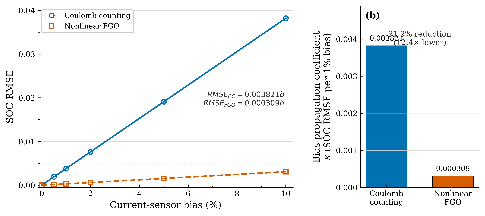
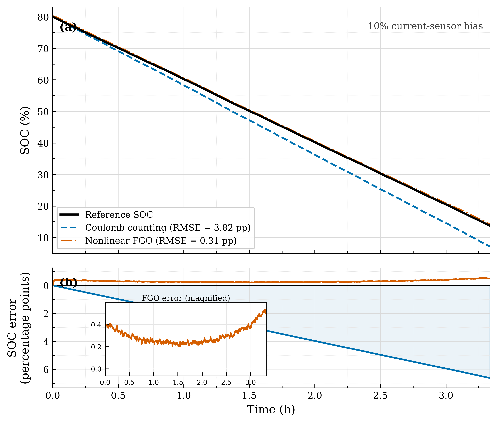
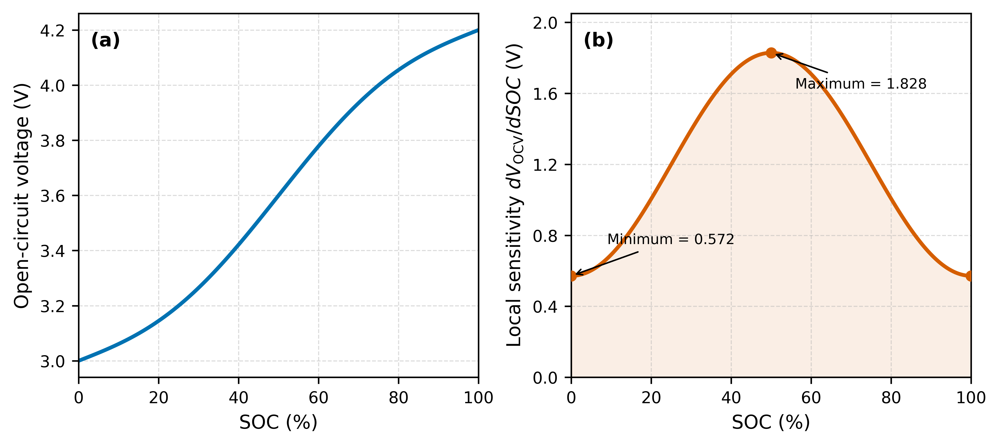

# Robust Battery State-of-Charge Estimation under Current Sensor Bias Using Nonlinear Factor Graph Optimization

## Abstract

Systematic current-sensor bias causes cumulative drift in battery state-of-charge (SOC) estimates obtained by Coulomb counting (CC). This study investigates whether nonlinear factor graph optimization (FGO), combining current-based state transitions with voltage-based measurement constraints, can reduce the propagation of this bias. A first-order RC battery model was used to generate a 12,001-sample dataset under a random discharge-current profile. Multiplicative current biases of 0.5%, 1%, 2%, 5%, and 10% were then imposed while the reference battery trajectory and terminal-voltage measurements were retained. The estimator used the same ohmic and polarization-voltage structure as the data generator, including reconstruction of the RC-branch voltage.

The RMSE of both methods increased approximately linearly with current bias; however, their propagation rates differed markedly. With bias expressed in percentage units, the fitted RMSE propagation coefficients were 0.003821 per 1% bias for CC and 0.000309 per 1% bias for nonlinear FGO. Thus, the voltage-constrained estimator reduced the first-order bias-propagation coefficient by 91.9%, corresponding to a coefficient ratio of 12.35. At 10% bias, the RMSE values were 0.038210 for CC and 0.003092 for nonlinear FGO. A controlled supporting case based on the first discharge cycle of the NASA B0005 dataset showed the same qualitative behavior: at 10% imposed current bias, the RMSE decreased from 0.049415 for CC to 0.016180 for FGO. Because the reference SOC and voltage model in this supporting case were derived from the same discharge record, it is presented as a controlled real-data perturbation test rather than independent experimental validation. The results show that nonlinear FGO does not eliminate systematic-bias propagation, but substantially reduces its rate by anchoring the SOC trajectory to voltage information.

**Keywords:** Battery management system; State of charge; Factor graph optimization; Current-sensor bias; Coulomb counting; Sensor robustness

## 1 Introduction

Accurate state-of-charge (SOC) estimation is essential for the safe and reliable operation of electric vehicles and battery energy-storage systems [1,2]. Because SOC cannot be measured directly, battery management systems infer it from measurable quantities such as current, terminal voltage, and temperature. Current measurements are particularly important because they determine the state transition in many SOC estimators. A systematic offset or scale error in the measured current therefore produces an error that accumulates over the operating horizon.

Coulomb counting (CC) remains widely used because of its simplicity and low computational cost [3]. Its principal weakness is that it directly integrates the measured current. A persistent current-sensor bias consequently produces an SOC error that grows with accumulated charge throughput and elapsed operating time [3–5]. This drift affects range prediction, energy management, and battery-protection decisions.

Model-based estimators can reduce this dependence on current integration by incorporating other observations [1,2,6]. Factor graph optimization (FGO) provides a general framework in which process relationships, measurements, priors, and additional physical constraints are represented as factors over a sequence of states [7,8]. For SOC estimation, current-based process factors describe temporal evolution, whereas voltage factors provide an independent constraint through the nonlinear open-circuit-voltage (OCV) relationship. The complete state trajectory is estimated jointly rather than propagated only from the preceding state. Our preceding study established the feasibility and accuracy benefit of linear and nonlinear voltage observation factors for battery SOC estimation [9].

Previous error analyses have shown theoretically that sensor bias and variance propagate differently through battery SOC estimators [4], while experimental evidence indicates that systematic bias can dominate random-noise effects in practical estimation settings [5]. These studies establish why sensor bias matters, but they do not quantify how strongly a voltage-constrained factor-graph estimator transmits a controlled current bias into trajectory-level SOC error. The present work addresses this gap through an explicitly defined RMSE bias-propagation coefficient.

This study focuses on the propagation of multiplicative current-sensor bias rather than nominal-condition accuracy alone. Controlled bias levels are imposed on a common simulated trajectory, and the response of CC and nonlinear FGO is quantified using RMSE and MAE. In addition to reporting individual error values, the study characterizes the first-order relationship between imposed bias and SOC-estimation RMSE. This provides a direct measure of how strongly each estimator transmits current-sensor bias into the estimated SOC trajectory.

The main contributions are as follows:

1. A controlled current-bias experiment is formulated in which the underlying battery trajectory is fixed and only the measured current supplied to the estimators is perturbed.

2. A model-consistent nonlinear FGO estimator is implemented using both ohmic voltage drop and reconstructed RC-branch polarization voltage. A zero-bias test verifies consistency between the simulation and estimation models.

3. Robustness is quantified through an RMSE bias-propagation coefficient. The results show that nonlinear FGO reduces this coefficient by 91.9% relative to CC over the tested range.

4. A NASA B0005 discharge record is used as a controlled supporting case to examine whether the same qualitative bias-suppression mechanism appears with measured battery current and voltage.

## 2 Battery Model and Current-Bias Formulation

### 2.1 First-Order RC Model

A first-order RC equivalent-circuit model was used to generate the simulation data. This model class provides a practical compromise between representation of terminal-voltage dynamics and computational complexity [6]. It consists of an OCV source, an ohmic resistance \(R_0\), and a parallel \(R_1C_1\) branch representing polarization dynamics. Discharge current is defined as positive. For the transition from sample \(k-1\) to sample \(k\), SOC is updated as

\[
z_k=z_{k-1}-\frac{I_k\Delta t}{3600Q},
\]

where \(z_k\) is SOC, \(I_k\) is current in amperes, \(\Delta t\) is the sampling interval in seconds, and \(Q\) is battery capacity in ampere-hours.

The RC-branch voltage is updated by

\[
V_{\mathrm{RC},k}=\alpha V_{\mathrm{RC},k-1}+(1-\alpha)R_1I_k,
\qquad
\alpha=\exp\left(-\frac{\Delta t}{R_1C_1}\right).
\]

The terminal voltage is

\[
V_k=V_{\mathrm{OCV}}(z_k)-R_0I_k-V_{\mathrm{RC},k}.
\]

The nonlinear OCV function used in the simulation is

\[
V_{\mathrm{OCV}}(z)=3.0+1.2z-0.1\sin(2\pi z).
\]

The model parameters are \(Q=3.0\,\mathrm{Ah}\), \(R_0=0.05\,\Omega\), \(R_1=0.02\,\Omega\), \(C_1=2000\,\mathrm{F}\), and \(\Delta t=1\,\mathrm{s}\). The initial SOC is 0.8.

### 2.2 Multiplicative Current-Sensor Bias

The biased current supplied to the estimators is defined as

\[
I_k^{m}=(1+b)I_k,
\]

where \(b\) is the imposed multiplicative bias. The reference SOC trajectory and terminal-voltage sequence are not regenerated after imposing the bias. Consequently, all tested methods are evaluated against the same underlying battery trajectory, and changes in estimation error can be attributed to the biased current input.

## 3 Nonlinear Factor Graph Optimization

The SOC at every sample is represented by a graph variable \(z_k\). Following the standard factor-graph formulation, variables represent unknown states and factors encode local probabilistic constraints [7,8]. The graph contains one prior factor, current-driven process factors between adjacent SOC states, and nonlinear voltage factors associated with individual states.

### 3.1 Prior and Process Factors

The prior residual is

\[
e_0=z_0-\bar{z}_0,
\]

where \(\bar{z}_0\) is the known initial SOC. The process residual for the transition from \(k-1\) to \(k\) is

\[
e_{p,k}=z_k-z_{k-1}+\frac{I_k^{m}\Delta t}{3600Q}.
\]

This factor carries the same current-bias sensitivity as CC. Its contribution is balanced by the voltage factors over the complete trajectory.

### 3.2 Voltage Factor and RC-Voltage Reconstruction

For model consistency, the estimator reconstructs the polarization voltage recursively from the current supplied to the estimator:

\[
\widehat{V}_{\mathrm{RC},k}
=\alpha\widehat{V}_{\mathrm{RC},k-1}
+(1-\alpha)R_1I_k^{m}.
\]

The predicted terminal voltage is

\[
\widehat{V}_k
=V_{\mathrm{OCV}}(z_k)
-R_0I_k^{m}
-\widehat{V}_{\mathrm{RC},k},
\]

and the voltage residual is

\[
e_{v,k}=V_k^{m}-\widehat{V}_k.
\]

Including \(\widehat{V}_{\mathrm{RC},k}\) is important because omission of the polarization term would create structural mismatch between the simulator and estimator. Such mismatch could incorrectly be interpreted as estimator sensitivity to current bias.

### 3.3 Nonlinear Least-Squares Estimation

The complete SOC trajectory is obtained by minimizing the weighted nonlinear least-squares objective

\[
z_{0:N}^{*}=\arg\min_{z_{0:N}}
\left[
\frac{e_0^2}{\sigma_0^2}
+\sum_{k=1}^{N}\frac{e_{p,k}^2}{\sigma_p^2}
+\sum_{k=0}^{N}\frac{e_{v,k}^2}{\sigma_v^2}
\right].
\]

The factor standard deviations are \(\sigma_0=10^{-4}\), \(\sigma_p=10^{-3}\), and \(\sigma_v=0.02\,\mathrm{V}\). CC provides the initial trajectory for optimization. The simulation estimator was implemented in C++ using GTSAM [8] and solved with the Levenberg–Marquardt algorithm [10,11].

## 4 Experimental Design

### 4.1 Simulation Dataset

The simulation duration was 12,000 s with a 1 s sampling interval, producing 12,001 samples. A random discharge-current profile ranging from 0.2 to 1.0 A was applied. The resulting dataset contained time, current, terminal voltage, and reference SOC. Five multiplicative current-bias levels were evaluated: 0.5%, 1%, 2%, 5%, and 10%. A zero-bias case was additionally processed to check implementation and model consistency.

CC and nonlinear FGO were evaluated using exactly the same biased current input, reference SOC, and voltage record at each bias level. The historical output-column name `soc_kf` is retained in some result files, but it represents the CC trajectory and not a Kalman-filter estimate.

### 4.2 Evaluation Metrics and Propagation Coefficient

The estimation error is \(\varepsilon_k=\widehat{z}_k-z_k\). RMSE and MAE are defined as

\[
\mathrm{RMSE}=\sqrt{\frac{1}{N}\sum_{k=1}^{N}\varepsilon_k^2},
\qquad
\mathrm{MAE}=\frac{1}{N}\sum_{k=1}^{N}|\varepsilon_k|.
\]

To characterize bias propagation, an origin-constrained linear model is fitted over the five nonzero bias levels:

\[
\mathrm{RMSE}(b_{\%})\approx\kappa b_{\%},
\]

where \(b_{\%}\) is the numerical bias value in percentage units; for example, \(b_{\%}=10\) represents 10% bias. Accordingly, \(\kappa\) is reported as SOC RMSE per 1% current bias. The suppression achieved by FGO is

\[
S=\left(1-\frac{\kappa_{\mathrm{FGO}}}{\kappa_{\mathrm{CC}}}\right)\times100\%.
\]

### 4.3 NASA B0005 Supporting Case

The first discharge cycle of NASA battery B0005 was used as a controlled supporting case [12]. It contains 197 samples and a reported discharge capacity of approximately 1.856 Ah. Reference SOC was constructed by integrating the original measured current and normalizing it by the reported capacity. Bias levels of 5% and 10% were imposed on the measured current, while the measured terminal-voltage record was retained.

For this supporting case, a fifth-order empirical voltage–SOC polynomial was fitted to the same discharge trajectory and used in a nonlinear least-squares estimator implemented with SciPy [13]. Therefore, the test examines the response to controlled current perturbations in a measured battery record, but it is not an independent validation of a transferable OCV model or directly measured SOC ground truth.

## 5 Results and Discussion

### 5.1 Zero-Bias Consistency Check

In the zero-bias simulation, CC produced an RMSE of \(6.15\times10^{-7}\), while nonlinear FGO produced an RMSE of \(4.70\times10^{-7}\). Their maximum absolute errors were both approximately \(1.0\times10^{-6}\). These near-numerical-precision errors confirm consistent transition indexing and consistent treatment of ohmic and RC-branch voltages between the data generator and estimator. This check is necessary before attributing changes in RMSE to imposed sensor bias.

### 5.2 Bias-Propagation Results

Table 1 summarizes the corrected simulation results.

| Current bias | CC RMSE | FGO RMSE | CC MAE | FGO MAE |
|---:|---:|---:|---:|---:|
| 0.5% | 0.001910 | 0.000155 | 0.001654 | 0.000150 |
| 1.0% | 0.003821 | 0.000310 | 0.003308 | 0.000300 |
| 2.0% | 0.007642 | 0.000619 | 0.006615 | 0.000601 |
| 5.0% | 0.019105 | 0.001548 | 0.016539 | 0.001501 |
| 10.0% | 0.038210 | 0.003092 | 0.033079 | 0.002999 |

Figure 1 shows that the RMSE of both estimators increases approximately linearly with imposed bias. The fitted coefficients are

\[
\kappa_{\mathrm{CC}}=0.003821,
\qquad
\kappa_{\mathrm{FGO}}=0.000309
\]

per 1% current bias. The corresponding origin-constrained coefficients of determination are 0.999999999 and 0.999999554, respectively. Thus, nonlinear FGO transmits only approximately 8.1% of the first-order RMSE growth observed in CC, giving a suppression of 91.9% and a coefficient ratio of 12.35.

This result changes the interpretation from an apparent performance crossover to a propagation-rate comparison. After enforcing model consistency, no RMSE crossover occurs within the tested bias range: FGO outperforms CC at every nonzero bias level. Nevertheless, FGO error still grows with bias. The appropriate conclusion is therefore that voltage constraints strongly attenuate, rather than eliminate, systematic-bias propagation.

### 5.3 Trajectory Behavior at 10% Bias

At 10% current bias, CC accumulated an RMSE of 0.038210 and an MAE of 0.033079. Its final SOC error reached −0.066213, or −6.62 percentage points. Nonlinear FGO reduced the RMSE to 0.003092 and the MAE to 0.002999; its final error was 0.004879, or 0.49 percentage points. Figure 2 shows that the CC trajectory progressively departs from the reference because every biased current sample contributes to the integrated error. The FGO trajectory remains much closer to the reference because voltage residuals distribute corrective information over the optimized state sequence.

### 5.4 OCV Sensitivity and Voltage-Constraint Strength

For the adopted nonlinear OCV model,

\[
\frac{dV_{\mathrm{OCV}}}{dz}
=1.2-0.2\pi\cos(2\pi z).
\]

As shown in Figure 3, the local OCV slope varies from 0.5717 to 1.8283 V per unit SOC, a ratio of approximately 3.20. A larger local slope means that a given SOC deviation produces a larger voltage residual and therefore a stronger observable correction. Conversely, lower-slope regions provide weaker voltage-based SOC information. This state-dependent sensitivity explains why the correction strength of the nonlinear voltage factor is not uniform across the SOC range. It also indicates that bias robustness depends partly on the OCV characteristics of the battery chemistry and operating region.

### 5.5 NASA B0005 Controlled Supporting Case

Table 2 summarizes the NASA B0005 perturbation results.

| Current bias | CC RMSE | FGO RMSE | CC MAE | FGO MAE |
|---:|---:|---:|---:|---:|
| 0% | 0.000000 | 0.016180 | 0.000000 | 0.011261 |
| 5% | 0.025850 | 0.016180 | 0.021200 | 0.011261 |
| 10% | 0.049415 | 0.016180 | 0.040541 | 0.011261 |

At 10% imposed bias, CC reached an RMSE of 0.049415, whereas FGO achieved 0.016180. The corresponding MAE values were 0.040541 and 0.011261. The measured-data case therefore reproduces the qualitative simulation result: voltage information limits the drift caused by biased current integration.

The FGO RMSE remains nearly unchanged across the three NASA bias settings because the empirical voltage relationship, fitted to the same trajectory, provides a strong trajectory-specific constraint. This should not be interpreted as proof that FGO is insensitive to bias in general. The reference SOC is derived from the original current record rather than independently measured, and the OCV model is calibrated and evaluated on the same discharge cycle. Accordingly, this section provides a controlled plausibility check using measured signals, while the quantitative propagation claim is based on the model-consistent simulation.

## 6 Conclusion

This study examined the propagation of multiplicative current-sensor bias in CC and nonlinear FGO SOC estimation. After aligning the simulation and estimation models through consistent transition indexing and inclusion of the reconstructed RC-branch voltage, both methods exhibited approximately linear RMSE growth over current biases from 0.5% to 10%. Their propagation rates, however, differed by more than one order of magnitude.

The RMSE propagation coefficient was 0.003821 per 1% current bias for CC and 0.000309 per 1% bias for nonlinear FGO. The voltage-constrained estimator therefore reduced the coefficient by 91.9%, corresponding to a ratio of 12.35. At 10% bias, FGO reduced RMSE from 0.038210 to 0.003092 and reduced the final SOC error magnitude from 6.62 to 0.49 percentage points. A zero-bias consistency test produced errors near numerical precision, supporting the validity of the corrected comparison.

The NASA B0005 supporting case showed the same qualitative reduction in bias-induced drift, but it was not treated as independent experimental validation because both the reference SOC and empirical voltage relationship were derived from the same discharge record. Overall, the results support a restrained conclusion: nonlinear FGO does not remove systematic current-bias effects, but substantially attenuates their propagation by combining current-driven transitions with voltage-based trajectory constraints.

## 7 Limitations and Future Work

The simulation uses a single first-order RC model, one parameter set, one random-current realization, and controlled multiplicative bias. It does not yet cover additive offsets, bias drift, temperature dependence, capacity uncertainty, parameter mismatch, voltage-sensor bias, or coupled stochastic noise. The full-batch optimizer also uses the entire trajectory and therefore does not represent an online BMS implementation.

The NASA B0005 case uses only one discharge cycle from one cell. Its reference SOC is constructed through capacity-normalized current integration, and the empirical voltage–SOC curve is calibrated and evaluated on the same trajectory. Future validation should use independently calibrated OCV models, multiple cells and aging states, temperature-varying profiles, repeated current realizations, and experimentally imposed or calibrated sensor biases.

Future methodological work should also evaluate sliding-window or incremental FGO for online deployment, jointly estimate bias as a latent state, quantify uncertainty, and compare the proposed framework with EKF, UKF, and other established SOC estimators under identical model and sensor conditions.

## Data Availability Statement

The processed simulation datasets, processed NASA B0005 supporting-case data, and result files used in this study are available in the repository associated with this work:

https://github.com/DJB19/soc_fgo_paper2

The original NASA battery-aging dataset is publicly available from the NASA Ames Prognostics Center of Excellence. Raw MATLAB files are not redistributed in the repository; only the processed files used for the present analysis are included.

## Code Availability Statement

The C++/GTSAM simulation estimator, current-bias generation scripts, NASA B0005 processing scripts, metric calculations, and figure-generation scripts are available at:

https://github.com/DJB19/soc_fgo_paper2

## Funding

This research received no external funding.

## Conflicts of Interest

The authors declare no conflicts of interest.

## References

[1] G. L. Plett, “Extended Kalman filtering for battery management systems of LiPB-based HEV battery packs: Part 3. State and parameter estimation,” *Journal of Power Sources*, vol. 134, no. 2, pp. 277–292, 2004, doi: 10.1016/j.jpowsour.2004.02.033.

[2] R. Xiong, J. Cao, Q. Yu, H. He, and F. Sun, “Critical review on the battery state of charge estimation methods for electric vehicles,” *IEEE Access*, vol. 6, pp. 1832–1843, 2018, doi: 10.1109/ACCESS.2017.2780258.

[3] K. Movassagh, S. A. Raihan, B. Balasingam, and K. R. Pattipati, “A critical look at Coulomb counting approach for state of charge estimation in batteries,” *Energies*, vol. 14, no. 14, Art. no. 4074, 2021, doi: 10.3390/en14144074.

[4] X. Lin, “Theoretical analysis of battery SOC estimation errors under sensor bias and variance,” *IEEE Transactions on Industrial Electronics*, vol. 65, no. 9, pp. 7138–7148, 2018, doi: 10.1109/TIE.2018.2795521.

[5] S. Mendoza, J. Liu, P. Mishra, and H. Fathy, “On the relative contributions of bias and noise to lithium-ion battery state of charge estimation errors,” *Journal of Energy Storage*, vol. 11, pp. 86–92, 2017, doi: 10.1016/j.est.2017.01.006.

[6] X. Hu, S. Li, and H. Peng, “A comparative study of equivalent circuit models for Li-ion batteries,” *Journal of Power Sources*, vol. 198, pp. 359–367, 2012, doi: 10.1016/j.jpowsour.2011.10.013.

[7] F. R. Kschischang, B. J. Frey, and H.-A. Loeliger, “Factor graphs and the sum-product algorithm,” *IEEE Transactions on Information Theory*, vol. 47, no. 2, pp. 498–519, 2001, doi: 10.1109/18.910572.

[8] F. Dellaert and M. Kaess, “Factor graphs for robot perception,” *Foundations and Trends in Robotics*, vol. 6, nos. 1–2, pp. 1–139, 2017, doi: 10.1561/2300000043.

[9] L. Zhang and D. Tashima, “Battery state-of-charge estimation using factor graph optimization with linear and nonlinear voltage observation models,” *Applied Sciences*, vol. 16, no. 14, Art. no. 7100, 2026, doi: 10.3390/app16147100.

[10] K. Levenberg, “A method for the solution of certain non-linear problems in least squares,” *Quarterly of Applied Mathematics*, vol. 2, no. 2, pp. 164–168, 1944, doi: 10.1090/qam/10666.

[11] D. W. Marquardt, “An algorithm for least-squares estimation of nonlinear parameters,” *Journal of the Society for Industrial and Applied Mathematics*, vol. 11, no. 2, pp. 431–441, 1963, doi: 10.1137/0111030.

[12] B. Saha and K. Goebel, “Battery Data Set,” NASA Prognostics Data Repository, NASA Ames Research Center, Moffett Field, CA, USA, 2007. [Online]. Available: https://www.nasa.gov/intelligent-systems-division/discovery-and-systems-health/pcoe/pcoe-data-set-repository/

[13] P. Virtanen *et al*., “SciPy 1.0: Fundamental algorithms for scientific computing in Python,” *Nature Methods*, vol. 17, no. 3, pp. 261–272, 2020, doi: 10.1038/s41592-019-0686-2.
